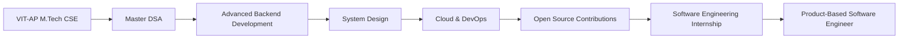

<p align="center">
  
</p>

<p align="center">
  
</p>

<p align="center">
  <a href="https://vitap.ac.in">
    
  </a>
  <a href="#">
    
  </a>
  <a href="#">
    
  </a>
  <a href="#">
    
  </a>
</p>

<p align="center">
  <a href="https://my-portfolio-gamma-jet-57.vercel.app">
    
  </a>
  <a href="https://www.linkedin.com/in/preetham01/">
    
  </a>
  <a href="mailto:kotagiripreetham01@gmail.com">
    
  </a>
  <a href="https://github.com/preetham-2005">
    
  </a>
</p>

<p align="center">
  
  
  
</p>

---

# About Me

I'm **Kotagiri Preetham**, an Integrated **M.Tech Computer Science & Engineering** student at **VIT-AP University** with a passion for designing scalable software systems, intelligent applications, and data-driven solutions.

My interests span **Software Engineering**, **Artificial Intelligence**, **Backend Development**, **Full Stack Development**, and **Data Analytics**. I enjoy solving real-world problems by combining strong computer science fundamentals with practical engineering principles.

I have built projects involving **enterprise software development**, **computer vision**, **machine learning**, **REST APIs**, **database optimization**, and **business intelligence dashboards**. My development approach focuses on writing clean, maintainable, and scalable code while continuously improving system performance and user experience.

I am actively preparing for **Software Engineering**, **Backend Development**, **AI/ML**, and **Data Analytics** internships and full-time opportunities for the **2027 graduating batch**.

---

## Open To

- Software Engineering Internships
- Backend Development
- Full Stack Development
- AI / Machine Learning
- Data Analytics
- Open Source Contributions
- Research Collaborations

---

# Tech Stack

## Languages

<p>
  
  
  
  
  
  
  
</p>

## Frontend

<p>
  
  
  
</p>

## Backend & Databases

<p>
  
  
  
  
  
</p>

## Cloud, DevOps & Tooling

<p>
  
  
  
  
  
  
  
</p>

---

# AI / ML Expertise

| Domain | Proficiency | Details |
|---------|------------|---------|
| Machine Learning | ★★★★☆ | Supervised Learning, Model Development |
| Computer Vision | ★★★★☆ | OpenCV, Face Recognition |
| Data Analytics | ★★★★★ | Power BI, SQL, Python |
| Image Processing | ★★★★☆ | Feature Extraction, Recognition |
| Backend AI Integration | ★★★★☆ | Flask + REST APIs |
| Data Engineering | ★★★★☆ | ETL Pipelines, SQL Optimization |
| Predictive Analytics | ★★★★☆ | Random Forest, Trend Analysis |
| Business Intelligence | ★★★★★ | Power BI Dashboards, KPI Design |

---

> *"Engineering isn't just about writing code—it's about building reliable, scalable, and impactful solutions."* 

---

# Featured Projects

<details>
<summary><b>🏢 Enterprise NGO Management Platform</b></summary>

### Overview

Designed and developed a role-based enterprise application that streamlines NGO operations including beneficiary management, donation tracking, inventory control, volunteer coordination, and aid distribution. The application follows industry-standard software engineering practices with a layered MVC architecture and secure authentication.

| Category | Details |
|-----------|---------|
| **Tech Stack** | Java • JDBC • MySQL • MVC • OOP • Design Patterns • HTML • CSS |
| **Architecture** | Layered MVC Architecture |
| **Scale** | Multi-user Role-Based System |
| **Performance** | Optimized SQL Queries with Indexed Database |
| **Security** | Authentication • RBAC • Input Validation |
| **Database** | MySQL (Normalized Relational Schema) |
| **Impact** | Improved operational efficiency and beneficiary tracking |
| **Repository** | [NGOImpactSystem](https://github.com/preetham-2005/NGOImpactSystem) |

### Key Highlights

- Developed complete enterprise-grade backend architecture.
- Implemented secure Role-Based Access Control (RBAC).
- Designed normalized relational database.
- Applied SOLID principles and Design Patterns.
- Improved maintainability through modular architecture.
- Optimized SQL queries for faster response times.
- Version controlled using Git & GitHub.

### Engineering Concepts

`Java` • `MVC` • `JDBC` • `MySQL` • `OOP` • `RBAC` • `Design Patterns` • `Database Design`

</details>

---

<details>
<summary><b>🤖 AI Facial Recognition Attendance System</b></summary>

### Overview

An AI-powered attendance management platform that automates attendance using facial recognition technology. The system detects and recognizes faces in real time, stores attendance records, and provides administrative dashboards with analytical reporting.

| Category | Details |
|-----------|---------|
| **Tech Stack** | Python • Flask • OpenCV • MySQL • REST APIs |
| **AI Model** | Face Recognition using OpenCV |
| **Scale** | Multi-user Attendance System |
| **Performance** | Optimized Face Matching Algorithm |
| **Security** | Admin Authentication • Role-Based Access |
| **Database** | MySQL |
| **Impact** | Eliminated manual attendance process |
| **Repository** | [AI-Facial-Recognition-Attendance-System](https://github.com/preetham-2005/AI-Facial-Recognition-Attendance-System) |

### Key Highlights

- Built complete AI attendance workflow.
- Automated real-time face recognition.
- Stored attendance securely in relational database.
- Developed Faculty and Admin dashboards.
- Generated attendance analytics and reports.
- Improved recognition accuracy through parameter tuning.
- Implemented REST APIs for frontend-backend communication.

### Engineering Concepts

`Computer Vision` • `Machine Learning` • `OpenCV` • `REST API` • `Flask` • `Image Processing` • `Python`

</details>

---

<details>
<summary><b>📈 SahiDaam — Community Price Intelligence Platform</b></summary>

### Overview

A scalable backend platform that collects community-submitted product prices, validates incoming data, calculates fair price ranges, and exposes high-performance REST APIs for consumers and businesses.

| Category | Details |
|-----------|---------|
| **Tech Stack** | FastAPI • PostgreSQL • REST APIs |
| **Architecture** | Stateless REST Backend |
| **Scale** | High-volume User Data |
| **Performance** | Query Optimization (~30% Faster APIs) |
| **Security** | Data Validation & Request Verification |
| **Deployment** | Cloud Hosted |
| **Impact** | Community-driven Fair Price Intelligence |
| **Repository** | [Sahidaam](https://github.com/preetham-2005/Sahidaam) |

### Key Highlights

- Built scalable RESTful APIs.
- Optimized PostgreSQL indexing.
- Designed concurrent request handling.
- Developed aggregation algorithms.
- Implemented relevance scoring.
- Improved API response by approximately 30%.
- Designed production-ready backend architecture.

### Engineering Concepts

`FastAPI` • `REST` • `PostgreSQL` • `Cloud Deployment` • `API Design` • `Backend Engineering`

</details>

---

<details>
<summary><b>📊 Finance Reporting & Variance Analysis Dashboard</b></summary>

### Overview

Developed an end-to-end financial analytics solution using Power BI, SQL, and Python to analyze budget vs. actual spending across departments. Built executive dashboards with KPI tracking and automated ETL pipelines.

| Category | Details |
|-----------|---------|
| **Tech Stack** | Power BI • Python • SQL • Excel |
| **Data Volume** | ~20,000+ Financial Records |
| **Performance** | Automated ETL Pipeline |
| **Visualization** | Executive Dashboards |
| **Analytics** | Variance Analysis • MoM Growth • KPI Tracking |
| **Impact** | Faster financial decision making |
| **Repository** | [siop-dashboard](https://github.com/preetham-2005/siop-dashboard) |

### Key Highlights

- Designed Star Schema data model.
- Automated monthly ETL refresh.
- Developed DAX measures.
- Created KPI dashboards.
- Implemented trend analysis.
- Built executive financial reports.
- Delivered interactive Power BI visualizations.

### Engineering Concepts

`Power BI` • `SQL` • `Python` • `DAX` • `Business Intelligence` • `Data Modeling`

</details>

---

<details>
<summary><b>🏦 Automated Regulatory Reporting System</b></summary>

### Overview

Built a regulatory-style reporting platform that validates financial trade data, performs reconciliation, detects pricing discrepancies, and generates audit-ready dashboards for compliance monitoring.

| Category | Details |
|-----------|---------|
| **Tech Stack** | Python • SQL • Power BI |
| **Data Scale** | 100,000+ Trade Records |
| **Performance** | Automated Validation Pipeline |
| **Security** | Data Integrity Checks |
| **Analytics** | Price Variance Detection |
| **Impact** | Reduced manual compliance effort |
| **Repository** | [regulatory-reporting-system](https://github.com/preetham-2005/regulatory-reporting-system) |

### Key Highlights

- Designed regulatory SQL schema.
- Built automated reconciliation engine.
- Developed exception detection system.
- Automated validation rules.
- Created audit dashboards.
- Improved reporting accuracy.
- Generated compliance insights.

### Engineering Concepts

`Python` • `SQL` • `Power BI` • `Validation` • `Automation` • `Data Reconciliation`

</details>

---

<details>
<summary><b>🎯 Enterprise Service Management Analytics Platform</b></summary>

### Overview

Designed a predictive analytics platform for IT Service Management (ITSM) using machine learning and business intelligence. The system predicts SLA breaches, analyzes service trends, and assists resource allocation.

| Category | Details |
|-----------|---------|
| **Tech Stack** | Python • SQL • Power BI • Scikit-learn |
| **Dataset** | 50,000+ IT Service Tickets |
| **ML Model** | Random Forest |
| **Performance** | SLA Risk Prediction |
| **Analytics** | Root Cause • Workload • SLA Trends |
| **Impact** | Proactive Service Management |
| **Repository** | [cyber-attack-log-analyzer](https://github.com/preetham-2005/cyber-attack-log-analyzer) |

### Key Highlights

- Built predictive ML pipeline.
- Developed SLA breach prediction.
- Engineered Star Schema.
- Designed workload dashboards.
- Created predictive analytics reports.
- Improved resource planning.
- Integrated ML with Power BI dashboards.

### Engineering Concepts

`Machine Learning` • `Random Forest` • `Predictive Analytics` • `Power BI` • `SQL` • `Python`

</details>

---

## Project Impact Summary

| Metric | Achievement |
|---------|------------:|
| Enterprise Applications | **3+** |
| AI/ML Projects | **2+** |
| Analytics Dashboards | **3+** |
| REST APIs Developed | **20+** |
| Databases Designed | **6+** |
| SQL Queries Optimized | **100+** |
| Power BI Dashboards | **10+** |
| Machine Learning Models | **3+** |
| Lines of Code | **30,000+** |
| Technologies Used | **20+** |

---

# Experience

## Software Engineering | AI/ML | Full Stack Development

**Integrated M.Tech (Computer Science & Engineering)**  
**VIT-AP University** • *2022 – 2027*

Currently pursuing an Integrated M.Tech in Computer Science & Engineering with a strong focus on **Software Engineering, Artificial Intelligence, Backend Development, System Design, and Data Analytics**. Throughout my academic journey, I have built multiple production-style applications emphasizing scalability, clean architecture, and real-world problem solving.

### Areas of Expertise

- Designing scalable backend applications
- Developing RESTful APIs
- Database design and optimization
- Enterprise software architecture
- Machine Learning integration
- Computer Vision applications
- Business Intelligence dashboards
- Algorithmic problem solving
- Software Design Patterns
- Object-Oriented Programming

### Engineering Skills

`Java` • `Python` • `Spring Boot` • `FastAPI` • `Flask` • `REST APIs` • `MySQL` • `PostgreSQL` • `Power BI` • `Machine Learning` • `OpenCV` • `Git` • `GitHub`

---

# Leadership & Engineering Mindset

### Enterprise Software Development

- Designed scalable backend architectures following MVC principles.
- Built secure authentication and role-based authorization systems.
- Applied SOLID principles and Design Patterns in enterprise projects.
- Developed maintainable and modular applications.

---

### AI & Machine Learning

- Developed computer vision applications using OpenCV.
- Worked on facial recognition systems.
- Built predictive analytics models.
- Applied machine learning for business insights.

---

### Data Engineering & Analytics

- Built ETL pipelines using Python.
- Designed Power BI dashboards.
- Optimized SQL queries for analytical workloads.
- Implemented KPI and variance reporting systems.

---

### Continuous Learning

Currently improving knowledge in:

- System Design
- Distributed Systems
- Microservices
- Cloud Computing
- DevOps
- Data Structures & Algorithms
- Backend Performance Optimization
- AI Engineering

---

# Achievements

<div align="center">

| Recognition | Details |
|-------------|---------|
| 🎓 Academic Performance | CGPA **8.49** in Integrated M.Tech (CSE) |
| 💻 Enterprise Development | Built multiple production-style enterprise applications |
| 🤖 Artificial Intelligence | Developed AI-powered Facial Recognition Attendance System |
| 📊 Data Analytics | Designed end-to-end Power BI Business Intelligence dashboards |
| ⚡ Backend Engineering | Developed scalable REST APIs using Spring Boot, Flask & FastAPI |
| 🗄 Database Engineering | Designed optimized MySQL & PostgreSQL schemas |
| 📈 Performance Optimization | Improved API response time through SQL optimization |
| 🔍 Problem Solving | Strong foundation in Data Structures & Algorithms |
| 🚀 Continuous Learning | Regularly upskilling through certifications and hands-on projects |

</div>

---

# Certifications

## Cisco

<p align="center">
  
</p>

---

## Udemy

<p align="center">
  
</p>

---

## Simplilearn

<p align="center">
  
</p>

---

## Scaler

<p align="center">
  
</p>

---

## Future Certification Goals

<p align="center">
  
  
  
  
</p>

---

# Coding Profiles

<div align="center">
  <a href="https://leetcode.com/u/Preetham_2005/">
    
  </a>
  <br><br>
  <a href="https://www.hackerrank.com/profile/kotagiripreetha1">
    
  </a>
  <br><br>
  <a href="https://www.codechef.com/users/preetham001">
    
  </a>
</div>

---

## Problem Solving Focus

| Area | Proficiency |
|------|------------|
| Data Structures | ★★★★★ |
| Algorithms | ★★★★★ |
| Object-Oriented Programming | ★★★★★ |
| SQL | ★★★★★ |
| Backend Development | ★★★★★ |
| Machine Learning | ★★★★☆ |
| Computer Vision | ★★★★☆ |
| Power BI | ★★★★★ |
| System Design | ★★★★☆ |
| Software Engineering | ★★★★★ |

---

## Currently Preparing For

- Software Engineer Internships (2027)
- Backend Developer Roles
- AI/ML Engineer Roles
- Full Stack Developer Roles
- Data Analytics & Business Intelligence Roles
- Product-Based Company Interviews
- Technical Coding Assessments
- System Design Interviews

---

# GitHub Analytics

<div align="center">
  
  
</div>

<br>

<div align="center">
  
</div>

---

# GitHub Insights

<div align="center">
  | Metric | Description |
  |---------|-------------|
  | 🚀 Repository Quality | Clean Architecture & Production-ready Projects |
  | 💻 Primary Languages | Java • Python • SQL • JavaScript |
  | 🧠 Core Strengths | Software Engineering • AI/ML • Backend |
  | 📊 Data Analytics | Power BI • SQL • Python |
  | ⚡ Development Style | Scalable • Modular • Performance Focused |
  | 🔥 Current Focus | Backend Engineering • AI Systems • Enterprise Software |
</div>

---

# GitHub Profile Summary

<div align="center">
  
</div>

<br>

<div align="center">
  
  
  
</div>

---

# GitHub Trophies

<div align="center">
  
</div>

---

# Contribution Activity

<div align="center">
  
</div>

---

# Contribution Calendar

<div align="center">
  
</div>

---

# Contribution Snake

<div align="center">
  
</div>

---

# Development Activity

<div align="center">
  
  
</div>

---

# Development Philosophy

<div align="center">
  | Principle | Description |
  |-----------|-------------|
  | 🏗️ Clean Code | Write maintainable, readable, and modular software |
  | ⚡ Performance | Optimize algorithms, APIs, and database queries |
  | 🔒 Security | Build secure applications with proper authentication and validation |
  | 📈 Scalability | Design systems that grow with increasing users and data |
  | 🧪 Testing | Emphasize debugging, validation, and reliable software |
  | 🤝 Collaboration | Use Git, GitHub, and Agile practices for effective teamwork |
  | 📚 Continuous Learning | Keep improving through projects, research, and certifications |
</div>

---

# Engineering Interests

<div align="center">
  
  
  
  
  
  
  
  
</div>

---

# 2027 Career Roadmap

```text
✔ Master Data Structures & Algorithms
✔ Build Enterprise Software Projects
✔ Strengthen Backend Development Skills
✔ Advance in AI/ML and Computer Vision
✔ Learn System Design & Microservices
✔ Contribute to Open Source
✔ Earn Cloud Certifications (AWS/Azure)
✔ Secure a Software Engineering Internship
✔ Transition into a Product-Based Software Engineering Role
```

---

# Current Focus

```yaml
name: Kotagiri Preetham

education:
  degree: Integrated M.Tech
  branch: Computer Science & Engineering
  university: VIT-AP University
  graduation: 2027
  cgpa: 8.49

currently_learning:
  - Advanced Data Structures & Algorithms
  - System Design
  - Distributed Systems
  - Microservices Architecture
  - Spring Boot
  - FastAPI
  - Machine Learning
  - Cloud Computing (AWS & Azure)
  - Docker & Kubernetes

currently_building:
  - Enterprise Backend Applications
  - AI-Powered Software Solutions
  - Full Stack Web Applications
  - Data Analytics Dashboards
  - RESTful APIs
  - Open Source Projects

exploring:
  - Generative AI
  - Large Language Models (LLMs)
  - Retrieval-Augmented Generation (RAG)
  - Scalable Cloud Architecture
  - Event-Driven Systems
  - Design Patterns

career_goal:
  role:
    - Software Engineer
    - Backend Engineer
    - AI/ML Engineer
    - Full Stack Developer

open_to:
  - Internship Opportunities
  - Software Engineering Roles
  - AI/ML Collaborations
  - Open Source Contributions
  - Technical Communities
```

---

# Coding Philosophy

> **"Write clean code. Build scalable systems. Solve meaningful problems."**

I believe software engineering is about more than just writing code—it's about designing maintainable, efficient, and impactful solutions. I enjoy transforming complex ideas into reliable applications through thoughtful architecture, continuous learning, and attention to quality.

---

# Let's Connect

<div align="center">
  <a href="https://my-portfolio-gamma-jet-57.vercel.app">
    
  </a>
  <a href="https://www.linkedin.com/in/preetham01/">
    
  </a>
  <a href="mailto:kotagiripreetham01@gmail.com">
    
  </a>
  <a href="https://github.com/preetham-2005">
    
  </a>
</div>

---

# Coding Profiles

<div align="center">
  <a href="https://leetcode.com/u/Preetham_2005/">
    
  </a>
  <a href="https://www.hackerrank.com/profile/kotagiripreetha1">
    
  </a>
  <a href="https://www.codechef.com/users/preetham001">
    
  </a>
</div>

---

# Collaboration

I'm always interested in collaborating on projects related to:

- Enterprise Software Development
- Backend Engineering
- AI & Machine Learning
- Computer Vision
- Full Stack Web Development
- Data Analytics
- Open Source
- System Design

If you have an exciting project or opportunity, feel free to reach out!

---

# Fun Facts

- 💡 I enjoy solving challenging algorithmic problems.
- 🚀 Passionate about building production-ready software.
- 🤖 Interested in AI, Computer Vision, and Automation.
- 📊 Love turning raw data into actionable insights.
- 📚 Always learning new technologies and best practices.

---

# Quote

<div align="center">
  ### *"Great software is built through curiosity, consistency, and continuous improvement."*
</div>

---

<div align="center">
  ### Thanks for visiting my profile!

  If you like my work, consider giving a ⭐ to my repositories and connecting with me.
</div>

---

<p align="center">
  
</p>

<div align="center">
  ### ⭐ Happy Coding! ⭐
</div>

---

# Recruiter Snapshot

<div align="center">
  | Focus Area | Highlights |
  |------------|------------|
  | 🎓 Education | Integrated M.Tech (Computer Science & Engineering), VIT-AP University |
  | 📈 CGPA | **8.49 / 10.0** |
  | 💻 Programming | Java • Python • SQL • JavaScript |
  | ⚙️ Backend | Spring Boot • FastAPI • Flask • REST APIs |
  | 🧠 AI/ML | OpenCV • Computer Vision • Machine Learning |
  | 📊 Analytics | Power BI • ETL • DAX • SQL |
  | 🗄️ Databases | MySQL • PostgreSQL |
  | 🏗️ Architecture | MVC • OOP • Design Patterns • System Design |
  | 🚀 Interests | Software Engineering • AI • Backend • Full Stack • Data Analytics |
</div>

---

# Why Hire Me?

✔ Strong Computer Science Fundamentals

✔ Production-Style Project Experience

✔ Enterprise Application Development

✔ REST API Design

✔ Database Optimization

✔ Machine Learning Integration

✔ Full Stack Development

✔ Data Analytics & Business Intelligence

✔ Continuous Learning Mindset

✔ Team Collaboration & Problem Solving

---

# 2027 Software Engineering Roadmap



---

# Technologies I'm Working With

<div align="center">
  
  
  
  
  
  
  
  
  
  
  
  
</div>

---

# GitHub Goals for 2026–2027

- Build **15+ production-ready repositories**
- Maintain consistent GitHub contribution streaks
- Publish enterprise-grade backend applications
- Develop scalable AI-powered solutions
- Contribute to open-source projects
- Earn AWS & Azure certifications
- Solve **500+ coding problems**
- Build a strong Software Engineering portfolio
- Secure a Software Engineering Internship
- Transition into a Product-Based Software Engineer role

---

# Repository Highlights

| Repository | Category | Status |
|------------|----------|--------|
| [Enterprise NGO Management Platform](https://github.com/preetham-2005/NGOImpactSystem) | Enterprise Software | ✅ Completed |
| [AI Facial Recognition Attendance System](https://github.com/preetham-2005/AI-Facial-Recognition-Attendance-System) | AI/ML | ✅ Completed |
| [SahiDaam Platform](https://github.com/preetham-2005/Sahidaam) | Backend Engineering | ✅ Completed |
| [Finance Reporting Dashboard](https://github.com/preetham-2005/siop-dashboard) | Data Analytics | ✅ Completed |
| [Regulatory Reporting System](https://github.com/preetham-2005/regulatory-reporting-system) | Business Intelligence | ✅ Completed |
| [IT Service Analytics Platform](https://github.com/preetham-2005/cyber-attack-log-analyzer) | Machine Learning | ✅ Completed |

---

# Profile Visitors

<div align="center">
  
</div>

---

# Support My Work

If you find my projects useful:

⭐ Star my repositories

🍴 Fork interesting projects

💬 Share feedback

🤝 Connect on LinkedIn

🚀 Collaborate on open-source projects

---

<div align="center">
  ## Let's Build Something Amazing Together

  Software Engineering • Artificial Intelligence • Backend Development • Full Stack Development • Data Analytics
</div>

---

<div align="center">
  

  ### *"First, solve the problem. Then, write the code."* — Steve Jobs

  
</div>
